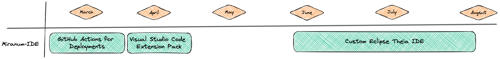
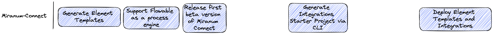
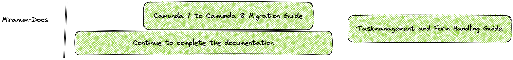

This section contains product manual content for each of the components in Miranum, including conceptual information. 
Miranum consists out of two major components. One is called Connect and the other IDE. Both of them can easily be used 
together or separately.
* [Miranum-IDE](./miranum-ide/intro-miranum-ide): This is an Integrated Development Environment targeted for designing and developing process automation projects. It is build and released as VS Code plugin and comes with: 
  * Forms - based on JSON Schema 
  * Realtime Collaboration support - via VS Code 
  * Templates - to ease the design of processes and forms. 
* [Miranum-Connect](./miranum-connect/intro-miranum-connect): Connect is a framework which enables its developers to build reusable and technology neutral connectors and integrations between products. It is designed according to the hexagonal architecture, its modules can be used independently. Hence, migrations don't have any impact on the business logic.

You will be able to find more information about the concepts of these tools and how you can utilize them by clicking on 
the referenced documentation pages. 

## What Miranum solves for you
* **One IDE for everything!** With our Visual Studio Code plugins you no longer need to access an external modeler. Edit, manage and access all artifacts for your process application in one place.
* Miranum-Connect enables you to create **reusable integrations** without getting locked into any vendor environments. We want to rely on **pro-code** instead of low-code, enabling you to build a sustainable and clean architecture.
* By being **technology neutral** you are set up for success when migrating to a newer version of your infrastructure components. 

We want you to  become truly digital by making every organization digitally self-sufficient.
We automate critical business processes at speed, relying on open technologies. 
At the same time, it is important to us to create flexibility for future adjustments and to customize the solution for our customers. 
This is what we stand for with our products.

## Roadmap
### Why whe have a public roadmap
Having a public roadmap for an open-source project is essential for several reasons. 
Firstly, it helps to build transparency and trust between the project team and the community. By sharing the project's upcoming 
features, milestones, and goals, users and contributors can better understand the direction the project is heading and contribute accordingly. 
Additionally, having a public roadmap can help to manage user expectations and reduce confusion about the project's development process. 
Users can see what features are planned, and when they can expect them to be implemented, rather than relying on vague promises or rumors. 
Finally, a public roadmap can help attract new contributors, as it shows that the project team is committed to maintaining and improving 
the project over the long term. Overall, having a public roadmap is an important part of building an active, engaged community around an open-source project.

### Miranum-IDE 
 
### Miranum-Connect 

### Miranum-Docs 
