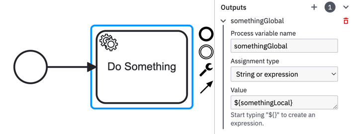

# Miranum-Worker
A Miranum-Worker connects to the process-engine (e.g. Camunda Platform 7 or 8) and fetches tasks of a certain type.
With this functionality, our integration perform various actions on such a task occurring in a process instance. After having
worked and completed a task via a worker, the process engine continues to the next step. 

To use the Miranum-Connect Worker, declare the following Maven dependency in your project:
```xml
<dependency>
    <groupId>io.miragon.miranum</groupId>
    <artifactId>worker-api</artifactId>
    <version>0.1.0-SNAPSHOT</version>
</dependency>
```

This dependency is usually added to the **<...>-core** module, which was introduced in the 
[project structure](./quick-reference.md#project-structure) of our quick-reference. 

## Implementing a Miranum-Worker 
The Worker is typically implemented in the **adapter-in** package. This results out of the nature of the hexagonal architecture 
we are using. The worker acts as an input we receive from the engine which drives the integration.
```bash
└── my-project-core
│   └── src
│     └── main
│       └── java
│         ├── adapter
│         │   ├── in
```

Having created a class in the package we now want to add such kind of worker. Therefore, we want to check our imports. 
Make sure to use:
```java
import io.miragon.miranum.connect.worker.api.Worker;
```

In the next step we want to implement a method which acts as a worker. 
This happens by adding the `@Worker` annotation. You are required to set a type in there. The type matches the corresponding
type/topic defined in the BPMN activity. 

Your method can be of any return type. Set void if you do not want to store anything back to the scope of the process engine. 
If you have an object in return it will be stored in a local-context in the process-instance. If you want to use it globally 
make sure to define the input/output mappings in your process.

```java
@Worker(type = "my-type") 
public void doSomething(DoSomethingCommand doSomethingCommand) {
    doSomethingUseCase.doSomething(doSomethingCommand);
}
```

### Commands and UseCases
As you can see in above examples we deal with Commands and UseCases. These are typically being created in the **ports-in** package
of our project structure.
```bash
│         ├── adapter
│         │   ├── in
│         │   └── out
│         ├── application
│         │   ├── port
│         │   │    ├── in
│         │   │    └── out
│         │   ├── service
```
The method has an input parameter of type `DoSomethingCommand`. This command contains the data which we need from 
the process in order to execute the worker. (e.g. a list of Strings). 

Whereas the `doSomethingUseCase` is an interface which exists in the same **ports-in** package.
The actual implementation of that interface can be found in the **service** package. The UseCase implementation could look
something like this:
```java
public class DoSomethingService implements DoSomethingUseCase {

    private final DomainObject domainObject;

    @Override
    public void doSomething(DoSomethingCommand doSomethingCommand) {
        domainObject.doSomething(doSomethingCommand.getSomething());
    }
}
```

That is also the point where we interact with our domain object and execute the actual business logic. Keep in ming that 
in a hexagonal architecture all dependencies point towards the domain-object. On itself it has no dependencies to anything else. 

### Return variables to the process
As already mentioned in a previous section of this documentation page, variables which are returned by the worker are treated as
local variables for an activity by default. To change this, [input / output mappings](https://docs.camunda.io/docs/components/concepts/variables/#inputoutput-variable-mappings) 
are required. (in this case we need the output mapping)

Below you can see an exemplary worker signature with return type `Something`. 
```java
@Worker(type = "my-type") 
public Something doSomething(DoSomethingCommand doSomethingCommand) 
```

Opening up our BPMN file in Miranum IDE and having created a process featuring a service task which calls our worker, 
we want to add an output mapping. In there, we map the local variable `something` to the global variable `somethingGlobal`. 



Having done so the variable `somethingGlobal` is accessible over the whole lifespan of the process-instance and could be
used as input in a subsequent activity of our process. 
