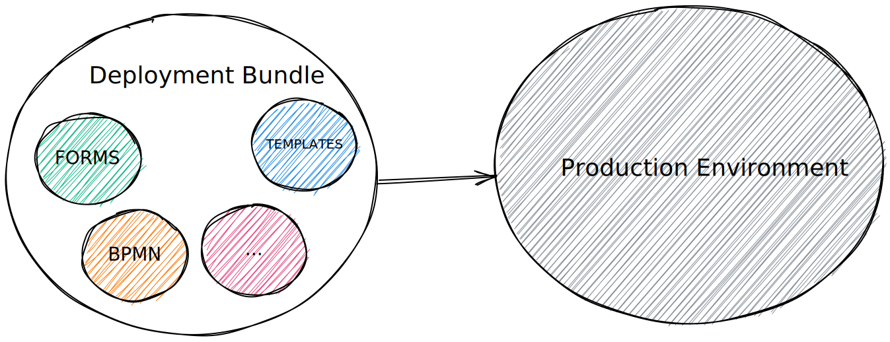

Miranum-IDE is an Integrated Development Environment targeted for designing and developing process automation projects. 
It is build and released as VS Code plugin. It consists out of three different plugins. To learn how to get started follow 
the [getting-started guide](../../guides/getting-started/gettingstarted-ide.md). 

To create end-to-end process application a collaboration platform for various roles (technical and non-technical) is needed. 
Since processes need multiple artifacts like templates (forms, mails, PDF), workflow assets (BPMN, DMN) and configuration files 
(secrets, connectors) we see the growing need for a platform being capable of handling all of them. With Visual Studio Code developers 
are able to work in a familiar environment. Even non-technical personas are able to visit VS Code through the browser and do not need to
fear any technical complexity. 

Besides of making collaboration and asset management easier, the deployment of a process application gets easier as well. 
Instead of needing to make sure that the right form version fits to the right process and vice verso you can handle this right 
in your git repository where the project lives in. It is comparable to a mono-repo for your process-application. This should 
help versioning your application and assets more easily.

