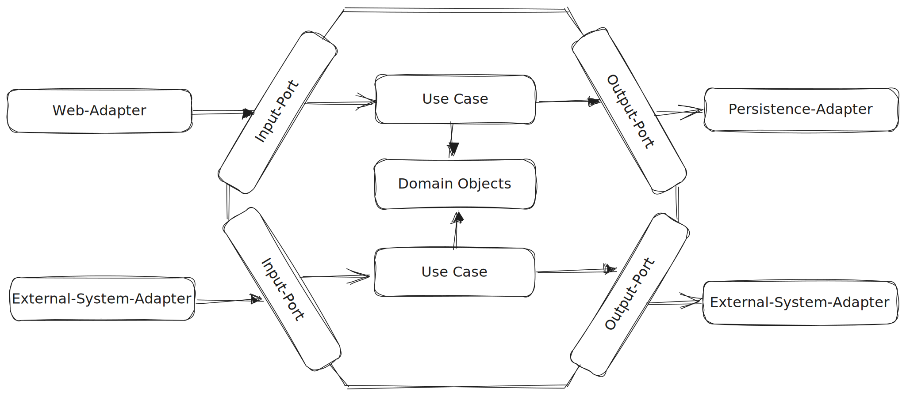

# Hexagonal Architecture

## Motivation

Layered architectures have long been a standard in software design. However, they often lead to tightly coupled code where changes in one layer can have far-reaching effects on others. Furthermore, testing can become an arduous task when business logic is closely intertwined with peripheral concerns like databases and interfaces. These drawbacks can result in a system that is brittle, difficult to maintain, and hard to understand.

The Hexagonal Architecture, or Ports and Adapters Pattern, is an architectural pattern that can drastically improve the maintainability and flexibility of your software. It enables you to isolate your application's core business logic from peripheral concerns like databases and interfaces, leading to software that is easier to test, understand, and evolve.

By dedicating time to understanding and applying the Hexagonal Architecture, you'll be able to create software systems that are resistant to change-induced errors, more manageable in the face of evolving requirements, and easier to comprehend for both new and experienced team members.

Let's dive into how the Hexagonal Architecture accomplishes this, and conclude some practical Do's and Don'ts for when you're implementing it in your own projects.

## Hexagonal Architecture explained

The hexagonal architecture, also known as Ports and Adapters, serves as an alternative to the well known layered architecture. The key difference is that all dependencies point inwards. At the core of the architecture lies the domain, which is independent of technologies and frameworks.

Figure 1: Hexagonal Architecture Diagram

### Domain Objects
In a domain rich with business rules, domain objects are the core of an application. Domain objects can contain both state and behavior. The closer the behavior aligns with the real world, the easier the code is to understand, replicate, and maintain.

Domain objects have no external dependencies. They provide an API through which use cases can be executed.

Since domain objects have no dependencies on other layers of the application, changes in other layers do not affect them. They can be evolved independently of dependencies. This exemplifies the Single Responsibility Principle. The Single Responsibility Principle, mentioned by Robert C. Martin in his paper "Design Principles and Design Patterns" is one of the main principles for clean software architecture which states that components should have only one reason to change. For our domain object, that reason is a change in business requirements.

With a single responsibility, domain objects can be developed without considering external dependencies. This ability for evolution makes the hexagonal architecture style suitable for the application of Domain-Driven Design (DDD). DDD is an approach to software development that places the business logic and requirements, represented by a conceptual model, at the center of design and implementation of the software.

### Use Cases
Use cases can be seen as abstract descriptions of user interactions with software. In the context of the hexagonal architecture, they are established as primary elements in the codebase.

A use case can be understood as a class that handles all aspects of a specific application scenario. For example, in a travel application, there could be a class named `BookFlightUseCase` that provides a specific API allowing users to book a flight. The code within this class encompasses all validations and business rule logics specific to the use case, which cannot be implemented within domain objects. Any additional requirements would be delegated to domain objects. For example, there could be a domain object called `Flight`.

In alignment with domain objects, a use case class has no dependencies on external components. If it requires data or functions outside the hexagon, an output port is created.

### Input and Output Ports
Domain objects and use cases reside within the hexagon, representing the core of the application. Any communication to and from the outside world is facilitated through dedicated ports.

An input port is a simple interface that can be called by external components and implemented by a use case. The component calling such an input port is referred to as an input or driving adapter.

An output port, on the other hand, is a simple interface that can be called by use cases when they need something from outside the system. It could be an output port to a database, providing important data to the use cases. This interface is designed to cater to the needs of use cases but is implemented by an external component referred to as an output or driven adapter.

With input and output ports, there are clear points at which data enters and exits the system, facilitating understanding of the architecture.

### Adapters
Adapters form the outer layer of the hexagonal architecture. They are not part of the core but interact with it.

Input adapters or driving adapters call the input ports to perform specific tasks. An input adapter could be a web interface, where pressing a button in a web browser triggers a specific input port to execute the corresponding use case.

Output adapters or driven adapters are called by use cases and could provide data from a database, for example. An output adapter implements a set of output port interfaces. It's important to note that the interfaces are determined by the use cases, not the other way around.

Adapters facilitate the interchangeability of a specific layer of the application. If the application needs to be accessible from a different client in addition to the web, an alternative client input adapter can be added, utilizing the existing input port. If the application requires a different database, a new persistence adapter implementing the same output port interfaces can be added.

## Hexagonal vs. Layer

To get a better understanding of the advantages the hexagonal architecture comes with, this section compares the two architectural styles based on the following criteria:

1. **Coupling:** How strong are the dependencies between the components of the system? Low coupling is usually preferable as it facilitates changes and maintenance.
2. **Drivers of Development:** Which part of the software drives the development? The adjustment of which part of the application brings a change in dependencies?
3. **Testability:** How easily can the components of the system be tested? Good testability is important for quality assurance and maintainability of the software.

### Coupling

In terms of minimizing coupling, the hexagonal architecture indeed offers advantages. It is explicitly designed to control dependencies within the system and to decouple the core of the application (i.e., business logic and use cases) from the details of the infrastructure (such as databases, user interfaces, networks, etc.).

This decoupling increases the system's flexibility, as changes to infrastructure details do not impact the core of the application. It also facilitates testing as the individual components of the system can be more easily isolated.

In contrast, while the layered architecture does allow for a clear and structured organization of the system, it can lead to stronger coupling between layers, potentially impacting flexibility and testability.

### Drivers of Development

In a layered architecture, where the persistence layer is the final layer and the domain is based on this, the design tends to be influenced by the underlying database structure. This is known as database-driven design, meaning that the organization and behavior of the software are determined by the structure and properties of the used database. While this can lead to efficient data processing, it can also cause the business logic to become tied to the database structure, potentially limiting system flexibility. Changes to the entities of the database thus necessitate an adjustment of the domain. The adjustment of this can lead to further necessary changes to dependent layers.

On the other hand, the hexagonal architecture aims to put the focus on business logic and use cases, known as domain-driven design. This means that the software's design is driven by understanding and modeling the business domain, rather than by technical details such as the database structure. This approach can lead to software closely tailored to business requirements and easily adaptable to changes in these requirements.

### Testability

Regarding testability, the hexagonal architecture shows some advantages. By using ports and adapters, the individual components of the application can be isolated and tested independently. The strict decoupling between the application core and the outer components allows the use of so-called mock objects for testing, simulating interactions with the outer components. This can simplify testing and improve the quality of tests, as it allows for more precise control of specific scenarios and edge cases.

While the layered architecture, though also capable of supporting well-structured and testable applications, can pose challenges concerning testability due to its stronger coupling between layers. Particularly, it may be more challenging to separate the layers for isolated testing. Changes to one layer may ripple to others, making testing more complicated.

In summary, the hexagonal architecture tends to exhibit higher testability, mainly through its ability to isolate the individual components of the application.

## Conclusion

Implementing the hexagonal architecture in software projects, particularly those heavy on domain logic, can bring immense benefits. It facilitates loose coupling, enhances testability, and encourages a clear focus on the core business logic. However, these benefits are realized only when the architecture is implemented properly. Missteps in the implementation can lead to unnecessary complexity and potential design issues.

Here are some concrete Do's and Don'ts that will guide you in properly applying the hexagonal architecture:

| Do's (🟢) | Don'ts (🔴) |
| ---- | ---- |
| Do keep your domain objects free from dependencies to ensure the core of your application remains independent of frameworks and external interfaces. | Don't design your domain objects to mirror their representation in the database. This could couple your domain logic too closely to specific database technology. |
| Do use Dependency Injection whenever possible to facilitate testing and to enhance the modularity of your code. | Don't allow the bypassing of your defined application ports. This could undermine the boundaries and isolation provided by the hexagonal architecture. |
| Do segregate your application into stable (inside) and volatile (outside) parts to isolate your core business logic from changes in external systems. | Don't make direct calls from your adapters to the domain layer. This could cause high coupling and reduced testability. |
| Do ensure that dependencies always point inwards. This means the inner layers should be independent of the outer layers. | Don't use frameworks that force your domain layer to depend on them. This could cause a violation of the Dependency Rule. |
| Do implement interfaces or 'ports' to communicate between your application and external systems, thus promoting loose coupling. | Don't allow your domain objects to be affected by changes in external systems or interfaces. This could compromise the integrity of your application's core. |

In conclusion, when correctly applied, the hexagonal architecture provides a robust and flexible structure that supports long-term maintainability and scalability. It allows developers to focus on the core business logic, safely insulated from the changing landscape of external systems and interfaces. Nevertheless, it's important to consider the specific needs and constraints of your project before deciding on an architecture. By adhering to the Do's and avoiding the Don'ts, you can make the most of the hexagonal architecture and create high-quality, resilient software.

Remember that choosing the right architecture is essential to the success of your software project. Hexagonal architecture, when applied appropriately, can provide a robust and flexible structure that supports long-term maintainability and scalability. But like all tools, it's most effective when used appropriately and with understanding.

Investing your time in mastering Hexagonal Architecture is not just about following a best practice—it's about gaining a powerful tool that will help you design better software systems, regardless of their size or complexity.

