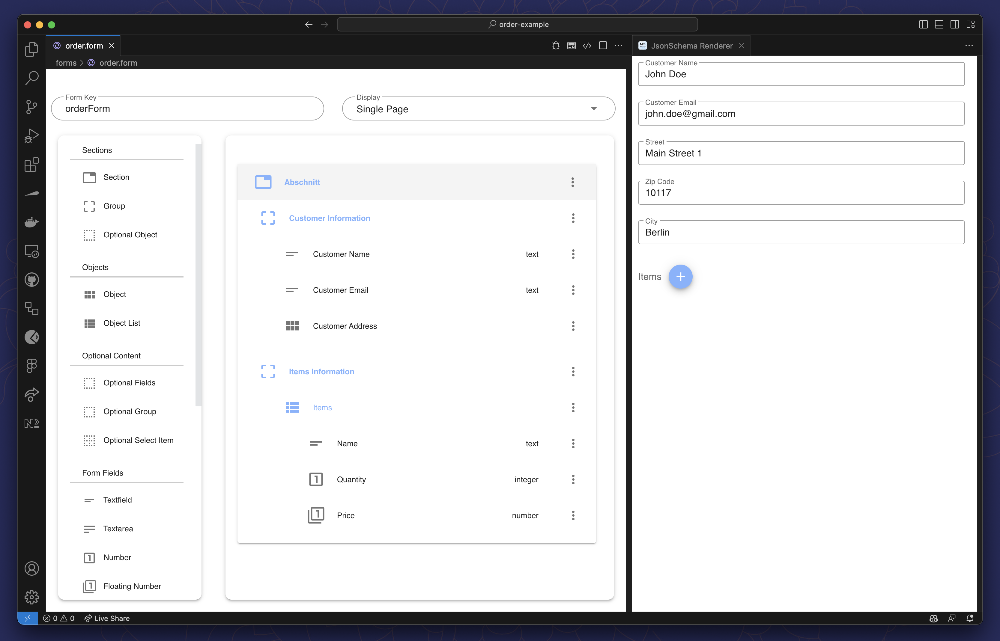

import ElementPalette from "../static/img/miranumIDE/miranumIDE_form-element-palette.png"
import General from "../static/img/miranumIDE/miranumIDE_form-general.png"
import Options from "../static/img/miranumIDE/miranumIDE_form-options.png"
import Validation from "../static/img/miranumIDE/miranumIDE_form-validation.png"
import KeyField from "../static/img/miranumIDE/miranumIDE_form-key-field.png"
import LinkToBpmn from "../static/img/miranumIDE/miranumIDE_form-link-to-bpmn.png"

# Miranum Form Builder Quickstart Guide

**Miranum Form Builder** is one component of the Miranum IDE.  
This plugin provides you with a custom editor to view and edit `.form` files.
The forms you build can be used within **Miranum Platform**.

:::info What You Will Learn
- [UI Elements](#ui-overview)
- [Create a Form](#create-a-form)
- [Link your Form to your Process](#link-your-form-to-your-process)
:::

## UI Overview

The Miranum Form Builder opens automatically when you click on a `.form` file in VS Code.

You will see a palette of different form elements on the left side of the editor.
The elements can be dragged and dropped into the editor to add them to your form.


To view the form, you can use the Preview on the right side of the editor.
The preview is automatically opened whe you use the Form Builder.
With the `Preview Button` in the top right corner of the editor you can toggle the preview.


## Create a Form

The generated project contains a `form` folder with two example forms.
You can use these forms as a starting point for your own forms.
To create your form, you have to be aware of this rule:
**_A Form Field can only be dropped into a Group, and a Group can only be dropped into a Section._**

```text
Section
  └── Group
        └── Form Field
```



With this rule in mind, you can start to create your form.

To configure or remove the form fields, click on the three dots right to the element and select `Edit` or `Remove`.  
Editing a form field opens a menu where you can enter a label, description or a regular expression for validation.

| General                                                  | Options                                                  | Validation                                                     |
|:---------------------------------------------------------|:---------------------------------------------------------|:---------------------------------------------------------------|
|  |  |  |

:::note
The key will be the name of the variable in the process that will hold the value of the form field.
:::

For example, enter the following regular expression to a `Textfield`'s validation field and then enter something in the corresponding
input field within the preview.

```text
^[a-zA-Z0-9_.+-]+@[a-zA-Z0-9-]+\.[a-zA-Z0-9-.]+$
```

## Link your Form to your Process

You can link your forms to a `Start Event` or a `User Task` in your process.
For that select one of these two elements and expand the `Forms` section in the properties panel.
Then select the key of the form you want to link to the element.

The key of a form can be edited in the top left corner of the Form Builder.

| Form Builder                                                     | BPMN Modeler                                                     |
|:-----------------------------------------------------------------|:-----------------------------------------------------------------|
|  |  |
