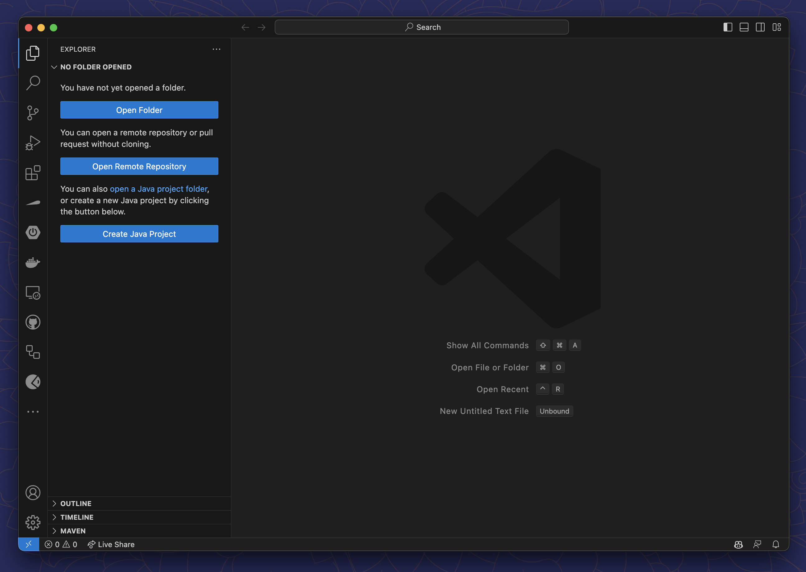
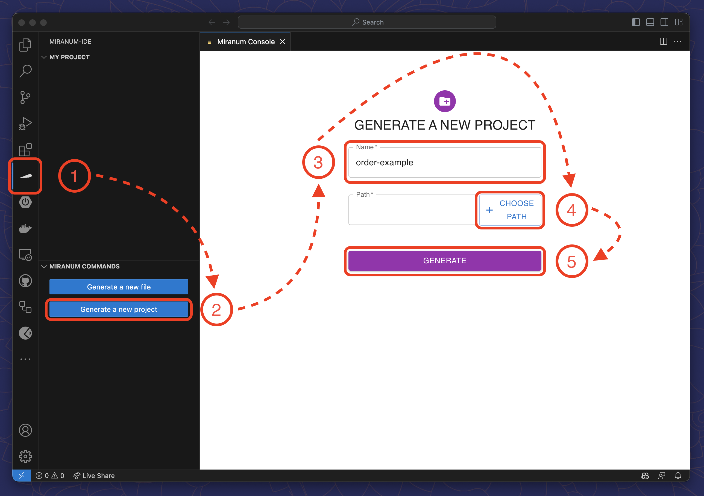

# Miranum Console Quickstart Guide

**Miranum Console** is one component of the Miranum IDE.  
It is a user interface for Miranum CLI that assists you in the creation of a new digitization project and the generation
of new process artifacts.

:::info What You Will Learn
- [How to create a new project](#create-a-new-project)
- [How to generate a process artifact](#generate-a-process-artifact)
:::

## Create a new Project

We start with an empty workspace in VS Code.
So your screen should look something like this:

To create a new project, follow these steps:
1. Select the Miranum Console view in the Activity Bar on the left side of VS Code.
2. Click on `Generate a new project` in the bottom left corner of the view.
3. Enter a name for your project.
4. Select a location for your project.
5. Click on `Generate`.

After a few seconds, the project and workspace are created.

Miranum Console will generate the following files and folders:

:::caution
BPMN diagrams must be created for the process engine they intend to be deployed on.
Right now (v0.5.3) the generated BPMN diagrams are only compatible with **Camunda 7**.
:::

* `miranum.json` - The project configuration file
* `.bpmn` - The BPMN diagram for **Camunda 7**
* `/forms` - The folder for your forms
* `/element-templates` - The folder for your element templates
* `/configs` - The folder for your configuration files

We will explore some of these files and folders in more detail in the following guides.

## Generate a Process Artifact

If your project needs more artifacts, you can generate them with **Miranum Console**.
1. Select the Miranum Console view in the Activity Bar on the left side of VS Code.
2. Click on `Generate a new file` in the bottom left corner of the view.
3. Enter a file name
4. Select the type of the file you want to generate
5. Click on `Generate`

## Deploy a Process

:::info
Miranum Console has a build in feature to deploy your artifacts within VS Code.
However, this feature is not up-to-date and needs to be overhauled.
You can still use the Miranum CLI to deploy your artifacts.

**The documentation for the Miranum CLI can be found [here](../miranum-cli-quickstart.md#deployment).**
:::
